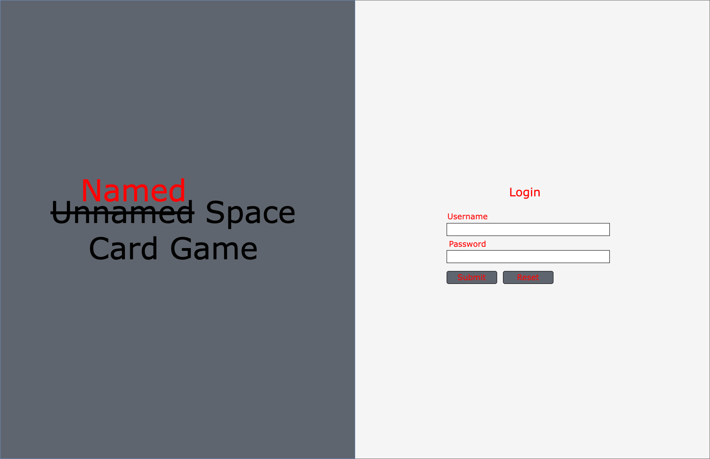
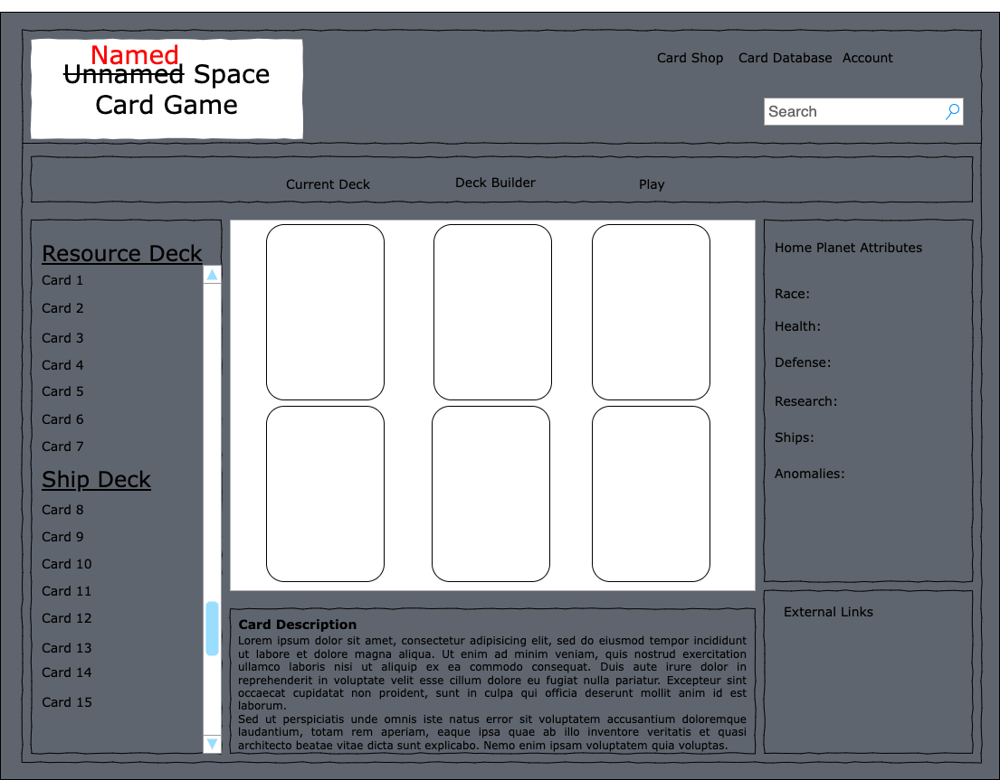

# Named Space Card Game
---
#### Wire frame

---
#### Technologies Used
- HTML/CSS
- Express
- MongoDB
- Node.js
- EJS
- Javascript

#### Trello Board
[Project 2](https://trello.com/invite/b/uhqPk6dR/ATTI642de943109f89b04ee55b427e464f68BF57A529/named-space-card-game) 

#### Tasks
- [ ] Establish main framework and server
- [ ] Set up MongoDB connection
- [ ] Build routes
- [ ] Be able to create/destroy decks
- [ ] Be able to modify add/remove cards from deck
- [ ] Link routes to ejs pages
- [ ] Build authentication for login
- [ ] Style with CSS